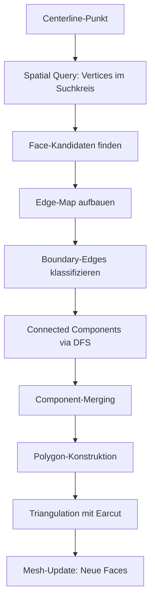

# Stitch Local Algorithm - Detaillierte Dokumentation

## Übersicht

Das **Stitch Local Algorithm** füllt Terrain-Lücken entlang von Straßen durch lokale Boundary-Polygon-Detektion und Triangulation. Statt globaler Boundary-Suche wird pro Centerline-Sample-Punkt ein Search-Circle angelegt und nur dort nach Loch-Polygonen gesucht.

**Hauptfunktion:** `find_boundary_polygons_in_circle()`  
**Datei:** `world_to_beamng/mesh/stitch_local.py`

---

## 1. Gesamtablauf



---

## 2. Detaillierte Algorithmus-Schritte

### **Schritt 1: Initialisierung & Parameter**

```python
def find_boundary_polygons_in_circle(
    centerline_point,      # (x, y, z) - Mittelpunkt des Search-Circles
    centerline_geometry,   # Vollständige Centerline-Geometrie
    search_radius,         # Suchradius in Metern (dynamisch: road_width + GRID_SPACING*2.5)
    road_width,            # Straßenbreite in Metern
    vertex_manager,        # VertexManager mit allen Mesh-Vertices
    mesh,                  # Mesh-Instanz
    terrain_vertex_indices,# Terrain-Vertex-Indizes (nicht aktiv verwendet)
    cached_verts=None,     # Optional: Cached Vertex-Array
    cached_kdtree=None,    # Optional: Cached KDTree
    cached_face_materials=None,  # Optional: Cached Material-Liste
    cached_vertex_to_faces=None, # Optional: Cached Adjacency
    cached_terrain_face_indices=None,  # Optional: Cached Terrain-Face-Set
    debug=False
)
```

**Initialisierung:**
- Extrahiere Centerline-Koordinaten `(cx, cy, _)`
- Hole alle Vertices aus VertexManager (oder Cache)
- Erstelle KDTree für räumliche 2D-Suche (nur X/Y)
- Baue Face-Material-Liste auf (terrain/slope/road)
- Initialisiere Vertex→Faces Mapping

---

### **Schritt 2: Räumliche Suche**

```python
circle_vertex_indices = kdtree.query_ball_point([cx, cy], r=search_radius)
```

**Ablauf:**
1. **KDTree Query:** Finde alle Vertices innerhalb `search_radius` vom Centerline-Punkt
2. **Frühes Abbruchkriterium:** Falls `< 3 Vertices` → Kein Polygon möglich, `return []`
3. **Erstelle Set:** `circle_vertex_set` für schnellen Lookup (O(1) statt O(n))

**Performance:** O(log n + k) mit k = Anzahl gefundener Vertices

---

### **Schritt 3: Centerline-Segmente Filtern**

```python
# Centerline in 2D
cl2d = centerline_geometry[:, :2]

# Segment-Mittelpunkte
seg_start = cl2d[:-1]
seg_end = cl2d[1:]
mids = 0.5 * (seg_start + seg_end)

# Distanz-Filterung
dx = mids[:, 0] - cx
dy = mids[:, 1] - cy
dist2 = dx * dx + dy * dy
mask = dist2 <= (search_radius + 5.0)²
```

**Zweck:**
- Vorfilterung der Centerline-Segmente auf Nähe zum Search-Circle
- Verhindert unnötige Crossing-Tests für weit entfernte Segmente
- **Buffer +5m:** Sicherheitsabstand für Edge-Crossing-Tests

**Rückgabe:**
- `seg_start_arr`: Start-Punkte der relevanten Segmente
- `seg_vec_arr`: Richtungsvektoren der Segmente
- `seg_mid_arr`: Mittelpunkte der Segmente

---

### **Schritt 4: Face-Kandidaten Finden**

```python
# Vertex→Faces Mapping nutzen
candidate_face_indices = set()
for v in circle_vertex_indices:
    candidate_face_indices.update(vertex_to_faces.get(v, ()))

# Faces filtern: ≥2 Vertices im Circle
for face_idx in candidate_face_indices:
    face = mesh.faces[face_idx]
    vertices_in_circle = sum(1 for v in face if v in circle_vertex_set)
    
    if vertices_in_circle >= 2:
        faces_in_circle.append(face)
```

**Kriterium "Face im Circle":**
- Mindestens **2 von 3 Vertices** müssen im Suchkreis liegen
- Verhindert falsche Positives durch einzelne Eck-Vertices

**Statistik:**
- Zähle `terrain_face_count` (Material == "terrain")
- Zähle `slope_face_count` (Material == "slope" oder "road")

**Abbruchkriterium:** Falls `< 2 Faces` → `return []`

---

### **Schritt 5: Edge-Map Aufbauen**

```python
edge_to_faces = defaultdict(list)

for face in faces_in_circle:
    for i in range(3):
        v1, v2 = face[i], face[(i + 1) % 3]
        edge = tuple(sorted([v1, v2]))  # Normalisierung
        edge_to_faces[edge].append(face_idx)
```

**Datenstruktur:**
```
edge_to_faces = {
    (v0, v1): [face_idx_A, face_idx_B],  # Shared edge
    (v1, v2): [face_idx_C],               # Boundary edge
    ...
}
```

**Normalisierung:** `tuple(sorted([v1, v2]))` macht Edges ungerichtet

---

### **Schritt 6: Boundary-Edges Klassifizieren**

```python
for edge, face_list in edge_to_faces.items():
    v1, v2 = edge
    
    # Beide Vertices im Circle?
    if v1 not in circle_vertex_set or v2 not in circle_vertex_set:
        continue
    
    # Fall A: Single-Face Edge (Außenrand)
    if len(face_list) == 1:
        boundary_edges_single_edges.append(edge)
    
    # Fall B: Material-Wechsel (nur Statistik)
    elif len(face_list) == 2:
        f1_mat = face_materials[face_list[0]]
        f2_mat = face_materials[face_list[1]]
        if (f1_mat == "terrain") != (f2_mat == "terrain"):
            boundary_edges_mixed += 1
```

**Boundary-Kriterien:**

| Fall | Beschreibung | Verwendung |
|------|-------------|------------|
| **A: Single-Face** | Nur 1 Face nutzt Edge | ✅ **Boundary-Edge** (offener Rand) |
| **B: Material-Wechsel** | 2 Faces, unterschiedliche Materialien | ❌ Nur Statistik, nicht für Components |

**Rational:**
- **Single-Face Edges** = Echter offener Rand = Loch im Mesh
- **Material-Wechsel** = Terrain↔Slope Grenze = Keine Lücke

**Abbruchkriterium:** Falls `< 3 boundary_edges` → `return []`

---

### **Schritt 7: Connected Components (DFS)**

#### **7.1 Centerline-Crossing Filter (Vektorisiert)**

```python
def _edges_cross_centerline_vectorized(edges_arr, verts, seg_start_arr, ...):
    # Edge-Mittelpunkte
    p1 = verts[edges_arr[:, 0], :2]
    p2 = verts[edges_arr[:, 1], :2]
    edge_mid = 0.5 * (p1 + p2)
    
    # Nächstes Centerline-Segment finden
    diff = edge_mid[:, None, :] - seg_mid_arr[None, :, :]
    dist2 = np.einsum("nsi,nsi->ns", diff, diff)
    nearest_idx = np.argmin(dist2, axis=1)
    
    # Side-of-Line Test (Cross-Product)
    cross_p1 = seg_vecs[:, 0] * to_p1[:, 1] - seg_vecs[:, 1] * to_p1[:, 0]
    cross_p2 = seg_vecs[:, 0] * to_p2[:, 1] - seg_vecs[:, 1] * to_p2[:, 0]
    
    return cross_p1 * cross_p2 < 0  # Verschiedene Seiten?
```

**Zweck:**
- Verhindert dass Components auf verschiedenen Straßenseiten verbunden werden
- **Cross-Product Sign:** Wenn Endpunkte auf verschiedenen Seiten → Edge überquert Centerline

**Performance:** Vektorisiert für alle Edges gleichzeitig (NumPy Broadcasting)

#### **7.2 DFS (Depth-First Search)**

```python
# Adjacency-List aufbauen
adj = defaultdict(list)
for v1, v2 in valid_edges_arr:
    adj[v1].append(v2)
    adj[v2].append(v1)

# DFS für jede Component
visited_vertices = set()
components_vertices = []

for start_v in adj.keys():
    if start_v in visited_vertices:
        continue
    
    component_verts = set()
    stack = [start_v]
    
    while stack:
        v = stack.pop()
        if v in component_verts:
            continue
        
        component_verts.add(v)
        visited_vertices.add(v)
        
        for neighbor in adj[v]:
            if neighbor not in component_verts:
                stack.append(neighbor)
    
    if len(component_verts) >= 3:
        components_vertices.append(component_verts)
```

**Algorithmus:**
1. **Adjacency-List:** Graph-Darstellung (ungerichtet)
2. **DFS:** Finde alle zusammenhängenden Vertices
3. **Edge-Extraction:** Extrahiere Edges die beide Endpoints in Component haben

**Rückgabe:** Liste von Edge-Listen `[[edges_comp_0], [edges_comp_1], ...]`

---

### **Schritt 8: Component-Merging**

```python
dynamic_merge_threshold = max(1.5, search_radius / 3.0)

if len(components) > 2:
    components = _merge_nearby_components(components, verts, merge_threshold)
```

#### **8.1 Endpoint-Detektion**

```python
def find_endpoints(comp_edges):
    adj = defaultdict(set)
    for v1, v2 in comp_edges:
        adj[v1].add(v2)
        adj[v2].add(v1)
    
    endpoints = [v for v, neighbors in adj.items() if len(neighbors) == 1]
    return endpoints
```

**Endpoint-Kriterium:** Vertex mit nur **1 Nachbar** = Pfad-Ende

#### **8.2 Merge-Kandidaten Finden**

```python
for i in range(len(components)):
    for j in range(i + 1, len(components)):
        for ep_i in component_endpoints[i]:
            for ep_j in component_endpoints[j]:
                dist = np.linalg.norm(verts[ep_i] - verts[ep_j])
                
                if dist <= merge_threshold:
                    merge_pairs.append((i, j, ep_i, ep_j, dist))
```

**Merge-Threshold:**
- **Formel:** `max(1.5m, search_radius / 3.0)`
- **Rational:** Bei größerem Suchradius mehr Toleranz für getrennte Components

#### **8.3 Union-Find Merging**

```python
parent = list(range(len(components)))

def find(x):
    if parent[x] != x:
        parent[x] = find(parent[x])  # Path compression
    return parent[x]

def union(x, y):
    px, py = find(x), find(y)
    if px != py:
        parent[px] = py
        return True
    return False

# Merge Components
for i, j, ep_i, ep_j, dist in sorted(merge_pairs, key=lambda x: x[4]):
    if union(i, j):
        synthetic_edges.append((ep_i, ep_j))
```

**Ablauf:**
1. **Sortiere** Merge-Paare nach Distanz (closest first)
2. **Union-Find:** Tracke welche Components zusammengehören
3. **Synthetische Edges:** Verbinde Endpoints zwischen Components

**Rückgabe:** Gemergte Component-Liste mit hinzugefügten Verbindungs-Edges

---

### **Schritt 9: Polygon-Konstruktion**

```python
polygon_vertices = _build_ordered_path_from_edges(component_edges)
```

#### **9.1 Ordered Path Building**

```python
# Finde Start-Vertex (Endpoint oder beliebig)
start_v = None
for v, neighbors in adj.items():
    if len(neighbors) == 1:  # Endpunkt
        start_v = v
        break

# Greedy Path Traversal
path = [start_v]
used_edges = set()
current = start_v

while True:
    # Finde unbenutzte Nachbarn
    available_neighbors = []
    for neighbor in adj[current]:
        edge = tuple(sorted([current, neighbor]))
        if edge not in used_edges:
            available_neighbors.append(neighbor)
    
    if not available_neighbors:
        break
    
    # Wähle ersten verfügbaren
    next_v = available_neighbors[0]
    edge = tuple(sorted([current, next_v]))
    used_edges.add(edge)
    
    path.append(next_v)
    current = next_v
```

**Algorithmus:**
- **Start:** Endpoint (Vertex mit 1 Nachbar) oder beliebig
- **Greedy:** Folge unbenutzten Edges bis keine mehr verfügbar
- **Edge-Tracking:** Verhindert Doppelnutzung

#### **9.2 Polygon-Validierung**

```python
# Entferne Loop-Duplikat
if polygon_vertices[0] == polygon_vertices[-1]:
    polygon_vertices = polygon_vertices[:-1]

# Mindestens 3 Vertices?
if len(polygon_vertices) < 3:
    return None
```

#### **9.3 Polygon-Dict Ausgabe**

```python
return {
    "vertices": polygon_vertices,        # [v0, v1, ..., vN]
    "coords": [tuple(verts[v]) for v in polygon_vertices],
    "terrain_count": terrain_count,      # Anzahl Terrain-Edges
    "slope_count": slope_count,          # Anzahl Slope-Edges
    "centerline_point": tuple(verts[polygon_vertices[0]])
}
```

---

### **Schritt 10: Triangulation (Ear Clipping)**

```python
def _triangulate_polygons(polygons, verts, mesh, debug=False):
    for poly in polygons:
        polygon_vertices = poly["vertices"]
        
        # Extrahiere 2D-Koordinaten
        coords_3d = np.array([verts[v] for v in polygon_vertices])
        coords_2d = coords_3d[:, :2]
        
        # Mapbox Earcut
        indices = triangulate_float64(coords_2d, ring_end_indices)
        
        # Mappe auf globale Indices und füge Faces hinzu
        for i in range(0, len(indices), 3):
            v0 = polygon_vertices[indices[i]]
            v1 = polygon_vertices[indices[i + 1]]
            v2 = polygon_vertices[indices[i + 2]]
            
            mesh.add_face(v0, v1, v2, material="terrain")
```

**Ear Clipping Algorithmus:**
1. **Input:** 2D-Polygon-Koordinaten (x, y)
2. **Output:** Dreiecks-Indizes bezogen auf Polygon-Vertices
3. **Mapping:** Lokale → Globale Vertex-Indizes
4. **Mesh-Update:** `mesh.add_face()` fügt neues Terrain-Face hinzu

**Vorteile:**
- Funktioniert mit **konkaven Polygonen**
- Keine Delaunay-Triangulation nötig
- Schnell und robust

---

## 3. Performance-Optimierungen

### **Caching-Strategie**

```python
# Static Caches (werden einmal pro stitch_all_gaps() erstellt)
verts_cache = vertex_manager.get_array()
kdtree_cache = cKDTree(verts_cache[:, :2])

# Dynamic Caches (werden inkrementell aktualisiert)
face_materials = [...]          # Erweitert sich bei neuen Faces
vertex_to_faces = {...}         # Erweitert sich bei neuen Faces
terrain_face_indices = {...}    # Erweitert sich bei neuen Faces
```

**Cache-Update nach Triangulation:**
```python
if len(mesh.faces) > total_face_count:
    for global_idx in range(total_face_count, len(mesh.faces)):
        face = mesh.faces[global_idx]
        mat = mesh.face_props.get(global_idx, {}).get("material")
        
        face_materials.append(mat)
        
        for v in face:
            vertex_to_faces.setdefault(v, []).append(global_idx)
        
        if mat == "terrain":
            terrain_face_indices.add(global_idx)
```

### **Vektorisierung**

| Operation | Ohne Vektorisierung | Mit NumPy |
|-----------|-------------------|-----------|
| Centerline-Crossing | O(E × S) Loop | `np.einsum()` |
| Segment-Filterung | Python Loop | Broadcasting |
| Distanz-Berechnung | Python Loop | `np.linalg.norm()` |

**Speedup:** ~10-50x für große Edge-/Segment-Mengen

---

## 4. Datenfluss-Diagramm

```
[Centerline-Sample-Punkt]
        ↓
[KDTree: Vertices im Radius]
        ↓
[Vertex→Faces Mapping]
        ↓
[Faces filtern: ≥2 Vertices im Circle]
        ↓
[Edge-Map: edge → [face_idx1, face_idx2]]
        ↓
[Boundary-Edges: len(faces) == 1]
        ↓
[Centerline-Crossing Filter (vektorisiert)]
        ↓
[DFS: Connected Components]
        ↓
[Merge nahe Components (Union-Find)]
        ↓
[Ordered Path Building (Greedy)]
        ↓
[Polygon-Validierung]
        ↓
[Earcut Triangulation (2D)]
        ↓
[mesh.add_face() × N Dreiecke]
        ↓
[Cache-Update: Neue Faces registrieren]
```

---

## 5. Edge-Cases & Fehlerbehandlung

### **5.1 Abbruchkriterien**

| Bedingung | Aktion |
|-----------|--------|
| `< 3 Vertices im Circle` | `return []` |
| `< 2 Faces im Circle` | `return []` |
| `< 3 Boundary-Edges` | `return []` |
| `< 3 Vertices im Polygon` | Skip Polygon |
| Triangulation fehlgeschlagen | Skip Polygon, Exception loggen |

### **5.2 Degenerierte Fälle**

**Leeres Centerline-Geometry:**
```python
if len(cl2d) < 2:
    seg_start_arr = None  # Kein Crossing-Filter
```

**Keine Centerline-Segmente in Reichweite:**
```python
if not np.any(mask):
    seg_start_arr = None  # Alle Edges werden akzeptiert
```

**Loop vs. Open Path:**
```python
# Loop: Entferne Duplikat am Ende
if polygon_vertices[0] == polygon_vertices[-1]:
    polygon_vertices = polygon_vertices[:-1]
```

---

## 6. Konfigurierbare Parameter

### **Dynamische Search-Radius-Berechnung**

```python
# In stitch_gaps.py
road_width = OSM_MAPPER.get_road_properties(osm_tags)["width"]
dynamic_search_radius = road_width + config.GRID_SPACING * 2.5
```

**Formel:**
```
search_radius = road_width + GRID_SPACING × 2.5
```

**Beispiele:**
- Schmale Straße (4m) + 2m Grid: `4 + 5 = 9m`
- Breite Autobahn (12m) + 2m Grid: `12 + 5 = 17m`

### **Merge-Threshold-Berechnung**

```python
dynamic_merge_threshold = max(1.5, search_radius / 3.0)
```

**Formel:**
```
merge_threshold = max(1.5m, search_radius ÷ 3)
```

**Rational:** Größere Suchkreise erlauben größere Component-Abstände

---

## 7. Debug-Export-Funktionen

### **7.1 Search-Circle Visualisierung**

```python
_export_search_circle_to_debug(
    centerline_point, 
    search_radius, 
    sample_rate=1
)
```

**Ausgabe:** Gelber Kreis (32 Segmente) im DAE-Export

### **7.2 Component-Linien Visualisierung**

```python
_export_component_lines_to_debug(
    components_edges, 
    verts, 
    centerline_point,
    component_type="auto",  # "terrain" (grün) | "road" (rot) | "auto"
    sample_rate=100
)
```

**Farben:**
- Component 0: Grün (Terrain-Seite)
- Component 1: Rot (Road-Seite)
- Component 2+: Blau-Varianten

### **7.3 Boundary-Polygon Visualisierung**

```python
_export_boundary_polygons_to_debug(
    polygons, 
    centerline_point,
    sample_rate=100
)
```

**Ausgabe:** Magenta Polygone mit Terrain/Slope-Count

---

## 8. Komplexitätsanalyse

| Phase | Komplexität | Dominant für |
|-------|-------------|--------------|
| **KDTree Query** | O(log N + k) | N = Vertices, k = im Circle |
| **Face-Filtering** | O(F × 3) | F = Candidate Faces |
| **Edge-Map** | O(F × 3) | F = Faces im Circle |
| **Crossing-Filter** | O(E × S) → O(E) | E = Edges, S = Segmente (vektorisiert!) |
| **DFS** | O(V + E) | V = Vertices, E = Edges |
| **Merging** | O(C²) | C = Components (~2-4) |
| **Path Building** | O(E) | E = Edges pro Component |
| **Triangulation** | O(n log n) | n = Polygon-Vertices (Earcut) |

**Gesamt-Komplexität:** O(log N + F + E + n log n)

**Bottlenecks (für große Meshes):**
1. **Triangulation:** Bei sehr großen Polygonen (>1000 Vertices)
2. **Face-Filtering:** Wenn viele Faces pro Circle

---

## 9. Fehlerquellen & Debugging

### **Häufige Probleme**

| Problem | Ursache | Lösung |
|---------|---------|--------|
| **Keine Polygone gefunden** | Search-Radius zu klein | Erhöhe `GRID_SPACING * 2.5` Buffer |
| **Zersplitterte Components** | Centerline-Crossing Filter zu aggressiv | Prüfe Centerline-Geometrie |
| **Merge schlägt fehl** | Merge-Threshold zu klein | Erhöhe `search_radius / 3.0` Faktor |
| **Triangulation Error** | Selbst-schneidendes Polygon | Prüfe Ordered Path Building |
| **Falsche Material-Zuweisung** | Cache nicht aktualisiert | Update `face_materials` nach jedem add_face |

### **Debug-Workflow**

1. **Aktiviere Debug-Flag:**
   ```python
   find_boundary_polygons_in_circle(..., debug=True)
   ```

2. **Exportiere Debug-Geometrie:**
   ```python
   _export_search_circle_to_debug(centerline_point, search_radius)
   _export_component_lines_to_debug(components, verts, centerline_point)
   _export_boundary_polygons_to_debug(polygons, centerline_point)
   ```

3. **Analysiere im DAE-Viewer:**
   - Gelbe Kreise = Search-Circles
   - Grün/Rot = Components (Terrain/Road-Seite)
   - Magenta = Finale Polygone

---

## 10. Zusammenfassung

**Kernidee:**
Statt globaler Boundary-Suche → Lokale Loch-Detektion pro Centerline-Sample

**Algorithmus-Pipeline:**
1. Spatial Query (KDTree)
2. Face-Kandidaten Filterung
3. Boundary-Edge Klassifikation
4. Connected Components (DFS + Crossing-Filter)
5. Component-Merging (Union-Find)
6. Polygon-Konstruktion (Greedy Path)
7. Triangulation (Earcut)
8. Mesh-Update

**Performance-Merkmale:**
- ✅ Vektorisierte Centerline-Crossing-Tests
- ✅ Multi-Level Caching (Static + Dynamic)
- ✅ O(log N) Spatial Queries
- ✅ Inkrementelles Cache-Update

**Robustheit:**
- ✅ Behandelt konkave Polygone
- ✅ Merged getrennte Components
- ✅ Verhindert Centerline-Überquerungen
- ✅ Graceful Degradation bei fehlenden Daten
